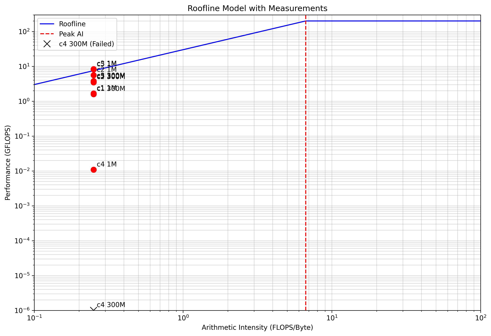

# HPML LAB 1

## Program Outputs

### Program 1
```
bash-5.1$ ./c1 1000000 1000
N: 1000000 <T>: 0.001196 sec B: 6.688135 GB/sec F: 1.672034 GFLOP/sec
```
```
bash-5.1$ ./c1 300000000 20
N: 300000000 <T>: 0.378504 sec B: 6.340759 GB/sec F: 1.585190 GFLOP/sec
```

### Program 2
```
bash-5.1$ ./c2 1000000 1000
N: 1000000 <T>: 0.000359 sec B: 22.299098 GB/sec F: 5.574774 GFLOP/sec
```
```
bash-5.1$ ./c2 300000000 20
N: 300000000 <T>: 0.173512 sec B: 13.831921 GB/sec F: 3.457980 GFLOP/sec
```

### Program 3
```
Singularity> ./c3 1000000 1000
N: 1000000 <T>: 0.000241 sec B: 33.164581 GB/sec F: 8.291145 GFLOP/sec
```
```
Singularity> ./c3 300000000 20
N: 300000000 <T>: 0.158740 sec B: 15.119100 GB/sec F: 3.779775 GFLOP/sec
```

### Program 4
```
bash-5.1$ python c4.py 1000000 1000
N: 1000000 <T>: 0.184602 sec B: 0.043337 GB/sec F: 0.010834 GFLOP/sec
```
```
bash-5.1$ python c4.py 300000000 20
Connection to greene.hpc.nyu.edu closed by remote host.
Connection to greene.hpc.nyu.edu closed.

[yp2378@log-burst ~]$ scontrol show job 2468
JobId=2468 JobName=bash
   UserId=yp2378(3872035) GroupId=yp2378(3872035) MCS_label=N/A
   Priority=15293 Nice=0 Account=ece_gy_9143-2024fa QOS=normal
   JobState=FAILED Reason=RaisedSignal:9(Killed) Dependency=(null)
   Requeue=0 Restarts=0 BatchFlag=0 Reboot=0 ExitCode=0:9
   RunTime=00:08:28 TimeLimit=01:00:00 TimeMin=N/A
   SubmitTime=2024-09-23T23:14:26 EligibleTime=2024-09-23T23:14:26
   AccrueTime=Unknown
   StartTime=2024-09-23T23:16:08 EndTime=2024-09-23T23:24:36 Deadline=N/A
   SuspendTime=None SecsPreSuspend=0 LastSchedEval=2024-09-23T23:14:26 Scheduler=Main
   Partition=n2c48m24 AllocNode:Sid=10.32.51.31:573188
   ReqNodeList=(null) ExcNodeList=(null)
   NodeList=b-10-91
   BatchHost=b-10-91
   NumNodes=1 NumCPUs=24 NumTasks=1 CPUs/Task=1 ReqB:S:C:T=0:0:*:*
   ReqTRES=cpu=1,mem=23500M,node=1,billing=1
   AllocTRES=cpu=24,mem=23500M,node=1,billing=24
   Socks/Node=* NtasksPerN:B:S:C=1:0:*:* CoreSpec=*
   MinCPUsNode=1 MinMemoryNode=0 MinTmpDiskNode=0
   Features=(null) DelayBoot=00:00:00
   OverSubscribe=NO Contiguous=0 Licenses=(null) Network=(null)
   Command=/bin/bash
   WorkDir=/home/yp2378
   Power=
```

### Program 5
```
bash-5.1$ python c5.py 1000000 1000
N: 1000000 <T>: 0.000245 sec B: 32.668978 GB/sec F: 8.167244 GFLOP/sec
```
```
bash-5.1$ python c5.py 300000000 20
N: 300000000 <T>: 0.165368 sec B: 14.513101 GB/sec F: 3.628275 GFLOP/sec
```

## Answers of Theroetical Questions

### Question 1
Explain the consequence of only using the second half of the measurements for the computation of the mean.

### Answer
During initial runs, factors like cache warming, code/data loading, and system stabilization may impact performance. We do this to exclude the warm up period.

### Question 3
Using the N = 300000000 simple loop as the baseline, explain the the difference in performance for the 5 measurements in the C and Python variants.

### Answer
| Program | Performance (GFLOPS) | Observation |
|---------|----------------------|------------|
| C1      | 1.585190             | Baseline performance. Simple loop implementation. |
| C2      | 3.457980             | Improved performance due to loop unrolling, which reduces loop overhead and allows for better instruction-level parallelism. |
| C3      | 3.779775             | Further improvement with SIMD vectorization, utilizing parallel processing capabilities of the CPU. |
| C4      | Failed               | Python implementation likely failed due to memory constraints or timeout, showcasing limitations of interpreted languages for large-scale computations. |
| C5      | 3.628275             | NumPy implementation in Python, nearly matching C3's performance due to its optimized, C-backed array operations. |

### Question 4
Check the result of the dot product computations against the analytically calculated result. Explain your findings. (Hint: Floating point operations are not exact.)

### Answer
To check the dot product results, we can compare the computed values from our programs against an analytically calculated result.

For vectors of size N filled with 1's, the analytical dot product would be N.

However, due to the nature of floating-point arithmetic, the computed results may slightly differ from the exact analytical value. This is because:

1. Floating-point numbers have limited precision.
2. Rounding errors can accumulate during computations.
3. The order of operations can affect the final result due to associativity issues in floating-point arithmetic.

We might observe small discrepancies between the computed and analytical results, especially for large N. These differences are typically very small but can be noticeable in applications requiring high precision.

To mitigate first issue of precision, i have updated the accumulator to double instead of float.

### Question 2
Draw a roofline model based on 200 GFLOPS and 30 GB/s. Add a vertical line for the arithmetic intensity. Draw points for the 10 measurements for the average results for the microbenchmarks.

### Answer

